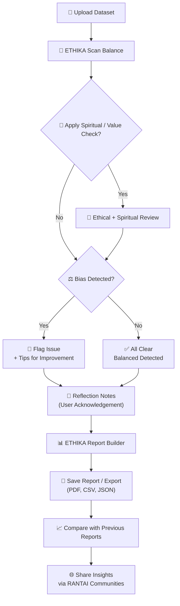
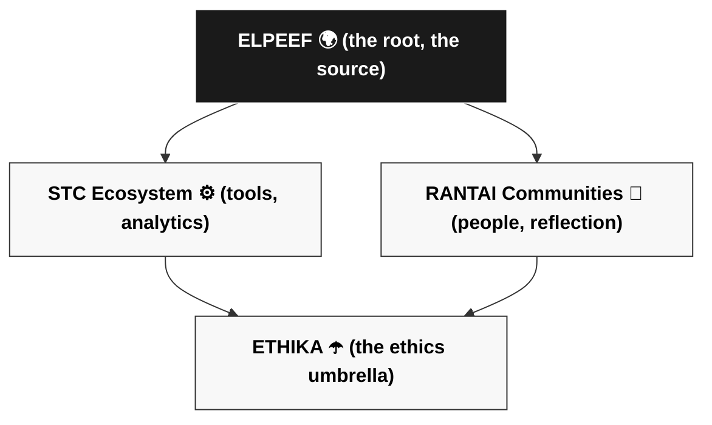
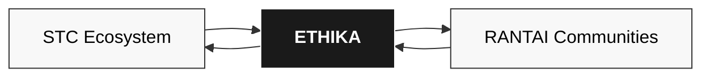

# RANTAI ETHIKA ⚖️

Ethics & Bias Checker for Data & Models

ETHIKA is an open-source tool designed to detect bias, ensure fairness, and promote ethical awareness in data exploration and predictive modeling.
It complements the EXPLODA → BUSI → PREDI pipeline by acting as a check & balance system, making sure results are not only accurate but also responsible.


---

## ✨ Features

- Dataset Balance Scanner → visualize distribution across categories with traffic-light indicators.

- Bias in Prediction → compare model performance across groups.

- Fairness Metrics (Optional) → demographic parity, equal opportunity.

- Explainable Flags & Tips → suggests actionable next steps.

- Ethical Reflection Notes → prompt users to document insights.

---

## 🛠 Installation

```bash
git clone https://github.com/mrbrightsides/rantai-ethika.git
cd ethika
pip install -r requirements.txt
```

---

## 🚀 Usage

```bash
python ethika.py --data dataset.csv --model model.pkl
```

Results include:

- Balance chart (distribution)

- Bias flags (⚠️ or ❌ if imbalance detected)

- Reflection template for ethical notes

---

## 📚 Academic Value

- Built for education: teaches not only how to analyze but also why ethics matter.

- Sparks classroom discussions on AI fairness and responsible data science.

---

## 🧩 Position in RANTAI Communities

EXPLODA → BUSI → MODEL PREDI → ETHIKA

| Module      | Link | Status | Badge |
|-------------|------|--------|-------|
| EXPLODA   | [rantai-exploda.streamlit.app](https://rantai-exploda.streamlit.app/) | ✅ Stable |  |
| BUSI   | [rantai-busi.streamlit.app](https://rantai-busi.streamlit.app/) | ✅ Stable |  |
| MODEL PREDI   | [rantai-model-predi.streamlit.app](https://rantai-model-predi.streamlit.app/) | ✅ Stable |  |
| ETHIKA     | [rantai-ethika.streamlit.app](https://rantai-ethika.streamlit.app/) | ✅ Stable |  |

---

## 🔄 Workflow



---

## 🌀 Hubungan ELPEEF, STC, RANTAI, dan ETHIKA

🌍 **ELPEEF** adalah sumber — titik awal gagasan, ruang lahirnya mimpi, tempat semua kolaboraksi dimulai. Dari sini, dua aliran besar tercipta:  
- ⚙️ **STC Ecosystem** → kumpulan tools, analytics, dan sistem yang memberi otot dan logika pada ekosistem.  
- 👥 **RANTAI Communities** → wadah manusia, refleksi, diskusi, dan gerakan sosial yang memberi jiwa dan napas.  

Keduanya tidak berdiri sendiri. Mereka saling tarik-menarik, saling isi, saling kritis. Tapi tetap saja, tanpa suatu penyeimbang, semua ini bisa kehilangan arah:  

☂️ **ETHIKA** hadir sebagai pusat gravitasi. Payung yang bukan sekadar pelindung, tapi pengingat. Bahwa setiap eksperimen, setiap tool, setiap komunitas, harus kembali ke nilai. Etika menjadi orbit yang menjaga agar STC dan RANTAI tidak melayang liar tanpa tujuan.  

✨ ELPEEF melahirkan.  
⚙️ STC membangun.  
👥 RANTAI menghidupkan.  
☂️ ETHIKA memayungi.





---

# 📜 License

MIT License – free to use, modify, and share.

